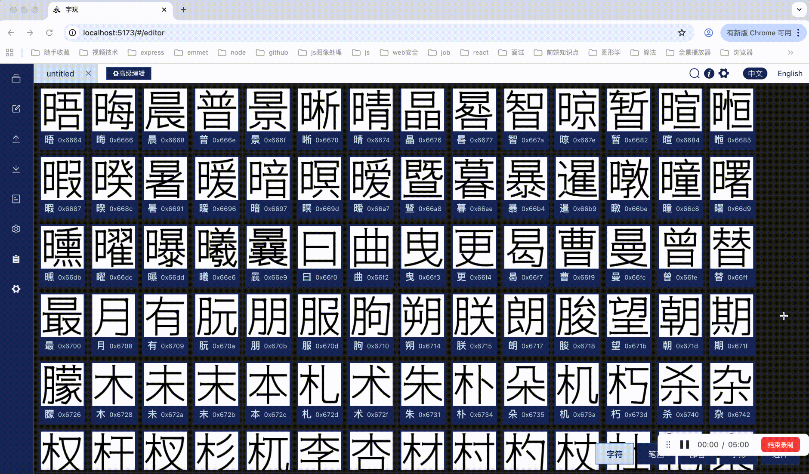

# 字玩FontPlayer
一款开源的字体设计工具。

使用Vue3 + Tauri2开发，支持Web端、MacOS和Windows平台。

官网：https://www.font-player.com

在线体验：https://toysmaker.github.io/fontplayer_demo/

桌面版下载：

gitee release: https://gitee.com/toysmaker/fontplayer/releases

github release: https://github.com/HiToysMaker/fontplayer/releases

桌面版包含：
- Windows: fontplayer_${version}_x64-setup.exe
- MacOS Intel芯片：fontplayer_${version}_x64.dmg
- MacOS Apple芯片：fontplayer_${version}_aarch64.dmg

### 部署步骤
#### 运行程序
首先安装依赖：
```
npm run install
```
运行程序：
```
npm run dev
```

#### 运行Tauri应用
开发环境下测试：
```
npx tauri dev
```

Tauri应用打包：
```
npx tauri build
```

### 什么是字玩？
字玩是一款用于生成个人字库（或图标字库）的开源创意工具。

使用字玩，您可以通过钢笔工具等图形编辑工具绘制字形，然后导出OTF字体文件。

同时，字玩支持从图片中导入字形，也支持自定义字形组件功能，并提供了可编程脚本模块。

字玩致力于探索以参数化、脚本化的方式设计中文字库，帮助用户高效设计个性化字体。

使用字玩，除了基本的钢笔绘制字形功能，您还可以：
  1. 使用字玩提供的笔画模板，通过可视化拖拽笔画骨架的方式组装字形
  2. 使用字玩提供的7000字模板工程，通过高级编辑界面一键修改字库风格，生成您的专属个性化字库
  3. 通过脚本功能，使用字玩API绘制任意您自己设计的可调参笔画或字形组件
  4. 允许用户上传手绘笔画形状，通过骨架绑定的方式绑定现有骨架参数。从而允许用户一键将7000字字库的笔画修改成个性手绘笔画

接下来，字玩还有更多创意正在探索中：
  2. TODO:整理汉字结构，实现参数化结构调整
  3. TODO:增加ASCII部分(数字字母符号)的参数化字形模板设计
  4. TODO:丰富中文笔画模板，提供更多风格的笔画供用户调参

### 使用指南
#### 笔画模板与字形组装
字玩以骨架+风格的思路抽象出可调参的笔画设计。字玩目前内置了黑、宋、仿宋、楷、隶五套基础可调参笔画模板，全部模板底层由脚本绘制。具体设计思路可以阅读[《使用程序绘制中文字体 —— 中文字体的参数化设计方案初探》](https://my.oschina.net/u/8675090/blog/18348928)。之后字玩会丰富笔画模板库，提供更多参数化笔画模板，也会在黑、宋、仿宋、楷、隶五套模板基础上，扩展更多可调参风格属性，比如衬线类型、运笔风格等等。

用户可以通过拖拽骨架的方式，将笔画组装成字形。经过实践，用32个可调参笔画已经可以拟合出思源黑体中7000个常用汉字，这意味着用32个笔画可以组装成任意汉字字形。



在新建工程时勾选“导入默认模板”会默认包含黑体风格的模板。

您可以在菜单中”模板“一栏中选择导入其他笔画模板。


#### 模板工程与高级编辑
字玩提供一个包含7000汉字的可调参模板工程，您可以调整模板工程中任意字形的骨架结构、风格参数以创建个性化字库。也可以在高级编辑界面调整全局变量批量调整字库风格。

- 模板工程中汉字笔画形状为原创，全部笔画使用脚本绘制
- 模板工程中字体结构重度参考思源黑体，特别向思源黑体致谢
- 模板工程中数字、字母、符号暂时直接思源黑体的字形，之后会逐步替换成参数化的设计

模板工程单独于字玩项目以SIL OPEN FONT LICENSE开源，您可以在发行版中下载模板工程：
- gitee release: https://gitee.com/toysmaker/fontplayer/releases | 文件名：字玩标准模板工程.zip
- github release: https://github.com/HiToysMaker/fontplayer/releases | 文件名：template.zip
- 使用方法：解压后使用字玩“打开工程”选项打开模板工程json文件

您可以：
  1. 将使用模板工程生成的字库用于个人或企业的设计作品中，无需声明模板作者字玩，并且允许商用
  2. 以SIL OPEN FONT LICENSE开源协议分享您通过模板工程制作的字库或您修改的模板

您不能：
直接售卖独创性不够的基于模板生成的字库

如果您希望售卖自己通过模板制作的字库，请知悉：由于模板中字形在结构上重度参考了思源黑体，受其开源协议限制，您不能售卖使用模板直接生成的字体。您可以利用模板拖拽骨架调整字形，设计出具有足够独创性的字库再进行售卖。

下载模板工程后，您可以直接使用字玩“打开工程”的选项打开模板工程。

在高级编辑界面，您可以批量修改字库风格。由于批量处理一小段时间，您可以选择20个以内样例字符作为调参所见即所得的预览，调整好参数后再一键应用到7000个字符上。


#### 使用脚本绘制字形组件
您可以使用脚本绘制任意形状的可调参字形组件，并在字符编辑中调用这些字形组件。具体教程和API参见：[字玩脚本教程](https://www.font-player.com/Advanced/programming/)

您也可以参考字玩提供的模板脚本进行修改：[笔画模板在gitee](https://gitee.com/toysmaker/fontplayer/tree/main/public/templates/templates2) | [笔画模板在github](https://github.com/toysmaker/fontplayer/tree/main/public/templates/templates2)

### 致谢
1. opentypes.js: https://github.com/opentypejs/opentype.js
字玩中字体文件解析生成模块参考了opentype.js的设计，并使用了部分代码

2. fitCurves: https://github.com/volkerp/fitCurves
字玩中拟合贝塞尔曲线模块参照了这个开源项目，改写为ts版

3. 字玩中图像处理部分使用了opencv.js，源码放在lib文件夹下，未做修改，拷贝自opencv官网：https://docs.opencv.org/4.5.0/opencv.js
注：opencv项目使用Apache-2.0 license协议，协议副本包含在lib文件夹中。感谢opencv的开源：https://github.com/opencv/opencv

4. 思源黑体：字玩中默认黑体模板在结构上参考思源黑体。思源黑体开源地址：https://github.com/adobe-fonts/source-han-sans